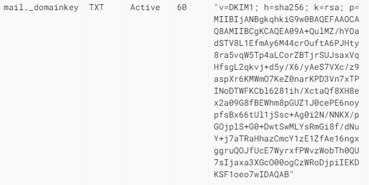

- [postfix](#postfix)
- [Install postfix](#install-postfix)
  - [Configure registry mail](#configure-registry-mail)
  - [Using transport](#using-transport)
- [Add DKIM, DMARC and SPF](#add-dkim-dmarc-and-spf)
  - [Create SigningTable](#create-signingtable)
  - [TrustedHosts](#trustedhosts)
  - [KeyTable](#keytable)
  - [Configure opendkim](#configure-opendkim)
  - [change /etc/default/opendkim](#change-etcdefaultopendkim)
  - [/etc/postfix/main.cf](#etcpostfixmaincf)
  - [edit /etc/postfix/master.cf](#edit-etcpostfixmastercf)
  - [add spf](#add-spf)
  - [add public key /etc/opendkim/keys/$DOMAIN/mail.txt](#add-public-key-etcopendkimkeysdomainmailtxt)
  - [add \_dmarc](#add-_dmarc)
- [check email](#check-email)

# postfix

# Install postfix
```
apt install postfix -y
```


```
systemctl restart postfix && systemctl enable postfix
```

Edit main.cf

```/etc/postfix/main.cf
mynetworks = 127.0.0.0/8 [::ffff:127.0.0.0]/104 [::1]/128 0.0.0.0/0

```

## Configure registry mail


Configure register MX


## Using transport

vi /etc/postfix/main.cf
```
transport_maps = hash:/etc/postfix/transport
postmap /etc/postfix/transport
```
```/etc/postfix/transport
domain.com smtp:[10.0.0.7]:25
```

# Add DKIM, DMARC and SPF

```
apt install opendkim opendkim-tools postfix-policyd-spf-python postfix-pcre -y
sudo adduser postfix opendkim

mkdir -p /etc/opendkim/keys
export DOMAIN=<domain>

cd /etc/opendkim/keys/
mkdir $DOMAIN
cd $DOMAIN
opendkim-genkey -s mail -d $DOMAIN
``````

## Create SigningTable
```
cat >>/etc/opendkim/SigningTable <<EOF
*@$DOMAIN mail._domainkey.$DOMAIN
EOF
```

## TrustedHosts
```
cat >> /etc/opendkim/TrustedHosts <<EOF
127.0.0.1
localhost

$DOMAIN
*.$DOMAIN
EOF
```

## KeyTable

```
cat > /etc/opendkim/KeyTable <<EOF
mail._domainkey.$DOMAIN $DOMAIN:mail:/etc/opendkim/keys/$DOMAIN/mail.private
EOF

```

## Configure opendkim
```/etc/opendkim.conf

AutoRestart Yes
AutoRestartRate 10/1h
SyslogSuccess Yes
LogWhy Yes
Canonicalization relaxed/simple
ExternalIgnoreList refile:/etc/opendkim/TrustedHosts
InternalHosts refile:/etc/opendkim/TrustedHosts
KeyTable refile:/etc/opendkim/KeyTable
SigningTable refile:/etc/opendkim/SigningTable
Mode sv
Socket inet:12301@localhost

```


## change /etc/default/opendkim
```/etc/default/opendkim
SOCKET="inet:12301@localhost"

```

## /etc/postfix/main.cf

```
milter_protocol = 2
milter_default_action = accept
smtpd_milters = inet:localhost:12301
non_smtpd_milters = inet:localhost:12301

policyd-spf_time_limit = 3600
smtpd_helo_required = yes
smtpd_recipient_restrictions =
    permit_mynetworks,
    permit_sasl_authenticated,
    reject_unauth_destination,
    check_policy_service unix:private/policyd-spf

smtp_tls_security_level = may
smtp_tls_ciphers = export
smtp_tls_protocols = !SSLv2, !SSLv3
smtp_tls_loglevel = 1

myhostname = <domain>

```

```
chown -R opendkim:opendkim /etc/opendkim

```

## edit /etc/postfix/master.cf

```
policyd-spf  unix  -       n       n       -       0       spawn
    user=policyd-spf argv=/usr/bin/policyd-spf

```


```
systemctl enable postfix
systemctl restart postfix
systemctl enable opendkim
systemctl restart opendkim

```

## add spf
```
v=sp1 a:<domain> ip4:<host ip> ~all
```


## add public key /etc/opendkim/keys/$DOMAIN/mail.txt

example



## add _dmarc

```
_dmarc.<domain> IN TXT "v=DMARC1; p=quarantine; rua=mailto:admin@<domain>; ruf=mailto:admin@<domain>;sp=none;"
```

# check email

https://mxtoolbox.com/dkim.aspx
